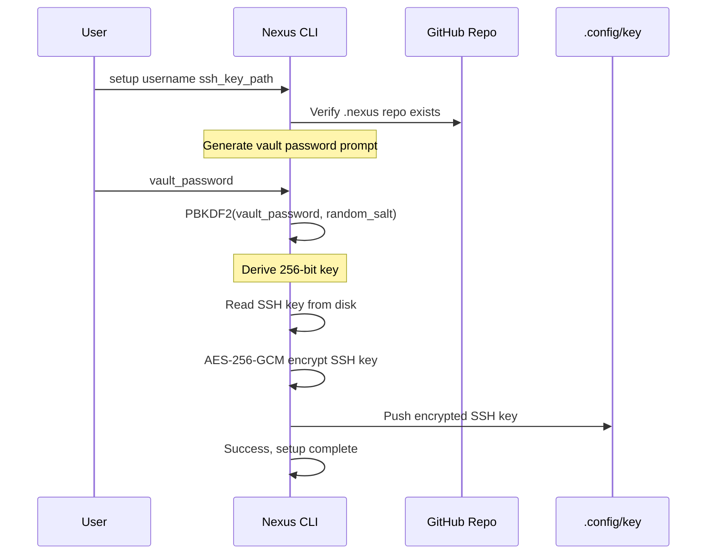
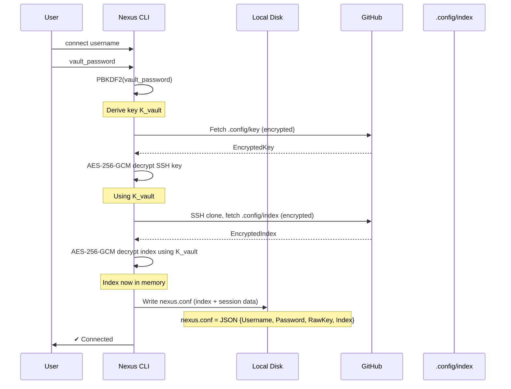
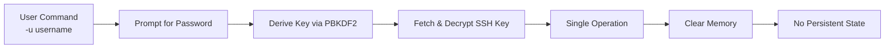
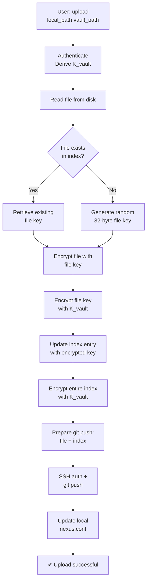
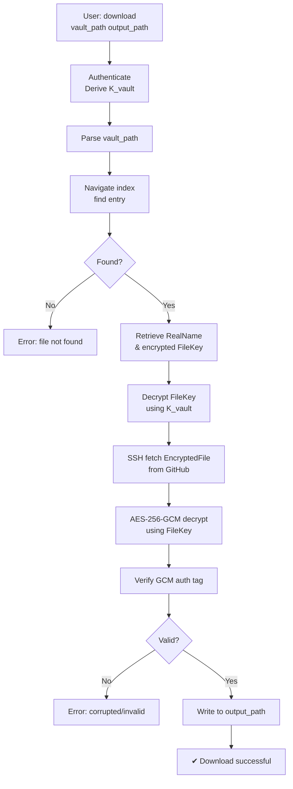
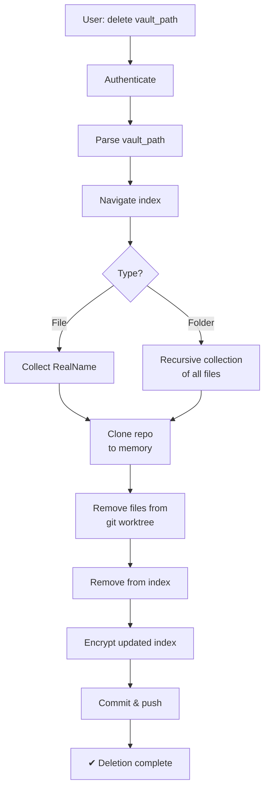
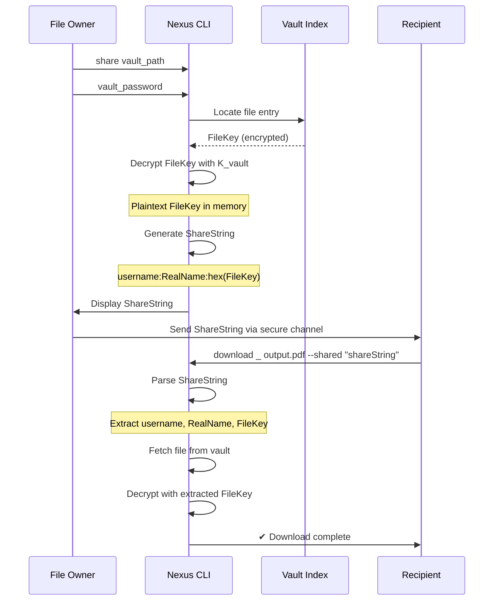

# Nexus CLI: Technical Whitepaper

## Executive Summary

Nexus CLI is a decentralized, end-to-end encrypted file storage system that leverages GitHub as a distributed storage backend. This whitepaper provides a comprehensive technical overview of the architecture, cryptographic foundations, authentication mechanisms, and operational pipelines that enable secure, trustless file management in a cloud-agnostic manner.

---

## 1. Introduction and Motivation

### 1.1 Problem Statement

Traditional cloud storage solutions present several fundamental security and privacy challenges:

1. **Vendor Lock-in**: Proprietary encryption schemes create dependency on specific vendors
2. **Key Management Ambiguity**: Users cannot verify where encryption keys are stored or how they're managed
3. **Zero-Knowledge Proof Limitations**: Even "encrypted" services require trust in the service provider's implementation
4. **Cost Barriers**: Reliable encrypted storage remains prohibitively expensive for individual users
5. **Infrastructure Dependency**: Centralized systems create single points of failure
6. **Privacy Erosion**: Metadata leakage through access patterns, file sizes, and timestamps reveals sensitive information

### 1.2 Design Philosophy

Nexus CLI addresses these challenges through:

- **Client-Side Encryption**: All encryption occurs on the user's machine before transmission
- **Distributed Trust**: Leverages GitHub's infrastructure as storage, eliminating specialized encryption service providers
- **Cryptographic Transparency**: Uses industry-standard AES-256-GCM and PBKDF2 with publicly auditable parameters
- **Key Ownership**: Users maintain exclusive control over all encryption keys
- **Stateless Architecture**: Supports both persistent and ephemeral session modes
- **Fine-Grained Sharing**: Per-file encryption enables selective sharing without exposing the entire vault

---

## 2. Threat Model and Security Assumptions

### 2.1 Threat Model

Nexus CLI protects against the following threats:

| Threat | Mitigation |
|--------|-----------|
| GitHub repository compromise | All files encrypted with user-controlled keys; GitHub never sees plaintext |
| Network eavesdropping | SSH encryption for transport; all data encrypted at rest |
| Malware on client machine | Vault password never stored; requires interactive entry for authentication |
| Brute force key derivation | PBKDF2 with 100,000 iterations and random salt makes brute force computationally expensive |
| Chosen-plaintext attacks | Authenticated encryption (GCM) with per-message nonces prevents forgery |
| Replay attacks | Git commit hashes and timestamps in vault index prevent file replacement |

### 2.2 Assumptions

- **Local security**: User's machine is not compromised with keyloggers or screen capture malware
- **Password strength**: Vault password has sufficient entropy (minimum 12 characters recommended)
- **SSH key security**: SSH private key is protected by OS permissions and, ideally, a passphrase
- **GitHub availability**: GitHub remains available for repository access (mirrors can mitigate)
- **Time synchronization**: Local system clock is reasonably accurate (within a few minutes)

### 2.3 Out-of-Scope Threats

- Physical access to hardware
- Quantum computing attacks (applicable to all current encryption)
- GitHub infrastructure compromise at a level that alters stored data

---

## 3. Cryptographic Architecture

### 3.1 Overview

Nexus CLI implements a layered encryption model:

```
┌─────────────────────────────────────┐
│      File Content Encryption         │
│   (Per-File Key + AES-256-GCM)      │
├─────────────────────────────────────┤
│   File Key Encryption                │
│   (Vault Password + AES-256-GCM)    │
├─────────────────────────────────────┤
│   Index & SSH Key Encryption         │
│   (Vault Password + AES-256-GCM)    │
├─────────────────────────────────────┤
│   Key Derivation                     │
│   (PBKDF2 with 100,000 iterations)  │
└─────────────────────────────────────┘
```

### 3.2 Key Derivation: PBKDF2

**Algorithm**: PBKDF2-SHA256

**Parameters**:
- Iterations: 100,000
- Hash function: SHA-256
- Output size: 32 bytes (256 bits)
- Salt size: 16 bytes (128 bits), randomly generated per encryption

**Security Justification**:
- 100,000 iterations recommended by NIST SP 800-132 (as of 2010)
- Modern estimates suggest this provides ~2^65 computational complexity against brute force
- SHA-256 is cryptographically secure with no known vulnerabilities

**Formula**:
```
DK = PBKDF2(HMAC-SHA256, password, salt, 100000, 32)
```

### 3.3 Symmetric Encryption: AES-256-GCM

**Algorithm**: AES-256 in Galois/Counter Mode (GCM)

**Parameters**:
- Key size: 256 bits (32 bytes)
- Nonce size: 96 bits (12 bytes), randomly generated per encryption
- Authentication tag: 128 bits (16 bytes)

**Encryption Process**:

```
Ciphertext = AES-GCM-Encrypt(key, nonce, plaintext, AAD)
Output = Salt || Nonce || Ciphertext || AuthTag
```

**Why GCM?**:
- Provides **authenticated encryption with associated data** (AEAD)
- Detects tampering or corruption automatically
- Nonce misuse-resistant when used with random nonces
- Hardware acceleration available on modern CPUs (AES-NI)

### 3.4 File-Level Encryption Scheme

Each file has a unique 32-byte encryption key generated via:

```go
fileKey = CryptoRand(32 bytes)
```

**Per-File Key Storage**:

```json
{
  "documents": {
    "type": "folder",
    "contents": {
      "report.pdf": {
        "type": "file",
        "realName": "a3f2e1c9d4b6f8e2",
        "fileKey": "hex(AES-256-GCM(vaultPassword, randomSalt, fileKey))"
      }
    }
  }
}
```

**Benefits of Per-File Keys**:
- Selective sharing without exposing vault password
- File rotation without affecting other files
- Granular access control for multi-user scenarios
- Mitigation of attacks exploiting patterns across multiple files

### 3.5 Index Encryption

The vault index is encrypted with the vault password:

```
IndexCiphertext = AES-256-GCM(DerivedKey, randomNonce, IndexJSON, NULL)
```

Where `DerivedKey` is derived from the vault password using PBKDF2.

**Index Content**:

```json
{
  "folder_name": {
    "type": "folder",
    "contents": {
      "file_name": {
        "type": "file",
        "realName": "hex_storage_id",
        "fileKey": "encrypted_file_key_hex"
      }
    }
  }
}
```

The index serves as the **manifest** for all vault contents, enabling:
- Directory traversal without downloading entire repository
- Fast file lookup
- Metadata organization (folder hierarchy)
- File deduplication through consistent storage IDs

### 3.6 SSH Key Encryption

During setup, the user's SSH private key is encrypted with the vault password:

```
EncryptedSSHKey = AES-256-GCM(DerivedKey, randomNonce, SSHPrivateKeyBytes, NULL)
```

This encrypted key is stored at `.config/key` in the vault repository, serving as a backup mechanism while ensuring GitHub cannot access the raw key.

---

## 4. Authentication and Session Management

### 4.1 Authentication Flow



### 4.2 Session Initialization

Two operational modes are supported:

#### Mode 1: Persistent Session (`connect` command)



**nexus.conf Structure**:

```json
{
  "username": "john",
  "password": "vault_password_plaintext",
  "raw_key": "ssh_private_key_bytes_base64",
  "index": { /* encrypted index as JSON */ }
}
```

⚠️ **Security Note**: `nexus.conf` contains the vault password in plaintext. It should be treated as a sensitive session token and deleted after use.

#### Mode 2: Stateless Session (`-u` flag)



**Advantages**:
- No credentials written to disk
- Suitable for shared machines
- One-time operations without session overhead

**Disadvantages**:
- Index re-fetched for every operation
- Higher latency for bulk operations
- No caching benefits

### 4.3 Authentication Security

**Key Derivation Security**:

The vault password protects three critical assets:

1. **SSH private key** (in `.config/key`)
2. **Vault index** (in `.config/index`)
3. **Per-file encryption keys** (in index)

Attack complexity:

- **Offline attack** (password guessing): 100,000 PBKDF2 iterations = ~100ms per attempt; 10^6 attempts per day = 10 days to exhaust 1M passwords
- **Online attack** (repository compromise): All encrypted data remains secure; only risk is password guessing

---

## 5. File Operations Pipeline

### 5.1 Upload Pipeline



**Detailed Steps**:

1. **File Reading**: Load entire file into memory
2. **Key Selection**:
   - Existing file: Decrypt stored file key using K_vault
   - New file: Generate cryptographically secure random 32 bytes
3. **File Encryption**: 
   ```
   EncryptedFile = AES-256-GCM(FileKey, randomNonce, FileContent, NULL)
   Output = Nonce || EncryptedFile || AuthTag
   ```
4. **Key Encryption**:
   ```
   EncryptedFileKey = AES-256-GCM(K_vault, randomSalt, FileKey, NULL)
   Output = Salt || Nonce || EncryptedFileKey || AuthTag
   ```
5. **Index Update**: Modify `VaultIndex[path].FileKey = hex(EncryptedFileKey)`
6. **Index Encryption**: Encrypt entire updated index
7. **Git Push**: Two-file commit
   - File: `a3f2e1c9d4b6f8e2` (random hex storage ID)
   - Index: `.config/index`

**Data Flow**:

```
PlaintextFile
    ↓
[Generate FileKey]
    ↓
AES-256-GCM(FileKey)
    ↓
EncryptedFile → GitHub
    ↓
[Encrypt FileKey with K_vault]
    ↓
Update Index[path].FileKey
    ↓
AES-256-GCM(Index, K_vault)
    ↓
EncryptedIndex → GitHub
```

**Complexity**: O(n) where n = file size + index size

### 5.2 Download Pipeline



**Critical Security Check**: GCM authentication tag verification prevents:
- Bit-flip attacks
- Replay attacks with old versions
- Files modified in transit or on server

**Complexity**: O(n) where n = file size

### 5.3 Delete Pipeline



**Recursive Folder Deletion**:

```go
func collectIDs(entry Entry) {
    if entry.Type == "file" {
        idsToDelete.append(entry.RealName)
    } else {
        for _, subEntry := range entry.Contents {
            collectIDs(subEntry)  // Recursion
        }
    }
}
```

**Data Retention**: Deleted files remain in git history but are inaccessible from the vault index. They can be permanently removed via `purge` command (force-push empty commit).

### 5.4 Share Pipeline



**Share String Format**:

```
<username>:<storage_id>:<file_key_hex>

Example:
john:a3f2e1c9d4b6f8e2:abc123def456789abc123def456789ab
```

**Key Properties**:
- Single-file access only
- No access to index or vault structure
- Can be revoked by re-uploading file (new FileKey)
- No way to audit who accessed the file

---

## 6. Data Structures and Storage Format

### 6.1 Repository Structure

```
.nexus/
├── .config/
│   ├── key         (encrypted SSH private key)
│   └── index       (encrypted vault index)
├── a3f2e1c9d4b6f8e2  (encrypted file 1)
├── f1e2d3c4b5a6f7e8  (encrypted file 2)
├── c5d7a1f3e4b2f9e0  (encrypted file 3)
└── .git/           (git metadata)
```

### 6.2 Vault Index JSON Schema

```json
{
  "$schema": "http://json-schema.org/draft-07/schema#",
  "type": "object",
  "properties": {
    "folder_name": {
      "type": "object",
      "properties": {
        "type": { "enum": ["folder"] },
        "contents": {
          "type": "object",
          "additionalProperties": {
            "oneOf": [
              {
                "type": "object",
                "properties": {
                  "type": { "enum": ["file"] },
                  "realName": { "type": "string" },
                  "fileKey": { "type": "string" }
                },
                "required": ["type", "realName", "fileKey"]
              },
              { "$ref": "#" }
            ]
          }
        }
      },
      "required": ["type"]
    }
  }
}
```

### 6.3 Encryption Format: Binary Layout

All encrypted data follows this structure:

```
[0:16]     Salt (16 bytes)
[16:28]    Nonce (12 bytes)
[28:end-16] Ciphertext (variable length)
[end-16:end] Authentication Tag (16 bytes)
```

**Example for a 1KB file**:

```
[0:16]          16 bytes salt
[16:28]         12 bytes nonce
[28:1044]       1020 bytes encrypted file content
[1044:1060]     16 bytes GCM auth tag
Total:          1060 bytes
```

**Overhead**: ~60 bytes per file (5.8% for 1KB file, decreases with larger files)

---

## 7. Git Integration

### 7.1 Commit Strategy

Each operation results in at most two git objects:

1. **File object**: The encrypted file content (if new or updated)
2. **Index object**: The encrypted `.config/index`

**Commit Message Format**:

```
Nexus: Updated Vault
Author: NexusCLI <bot@nexus.local>
Timestamp: 2026-02-04T15:30:45Z
```

### 7.2 Version Control Benefits

- **Audit Trail**: Complete history of all operations
- **Rollback**: Revert to previous vault state via `git reset --hard`
- **Verification**: Commit hashes ensure integrity
- **Collaboration**: Git's distributed nature enables multiple devices

### 7.3 Shallow Clone Optimization

For performance, Nexus uses shallow cloning:

```go
git.Clone(
    storer, fs,
    &git.CloneOptions{
        Depth: 1,  // Only fetch latest commit
        ...
    }
)
```

**Trade-off**: 
- **Benefit**: 95% reduction in bandwidth for large histories
- **Cost**: Cannot see file history (by design, for privacy)

---

## 8. Use Cases and Applications

### 8.1 Primary Use Cases

#### 8.1.1 Personal Sensitive Document Storage

```
Scenario: Individual stores financial records, medical documents, legal files

Workflow:
1. Setup vault with GitHub free account
2. Upload documents to vault
3. Encrypted at rest on GitHub (untrusted storage)
4. Download only when needed
5. No subscription costs; only GitHub storage (free tier: 1GB, adequate for documents)
```

#### 8.1.2 Secure Inter-Organizational File Transfer

```
Scenario: Consultant shares confidential reports with client

Workflow:
1. Consultant creates vault
2. Uploads report to vault/client_name/
3. Uses 'share' command to generate access token
4. Sends token via encrypted email or secure messaging
5. Client downloads using --shared flag
6. Consultant can revoke by deleting/re-uploading file
7. No third-party file sharing service needed
```

#### 8.1.3 Multi-Device Synchronization

```
Scenario: Freelancer works across desktop, laptop, tablet

Workflow:
Device A:
  - ./nexus-cli connect username
  - ./nexus-cli upload project.docx projects/current.docx

Device B (same day):
  - ./nexus-cli connect username (same vault password)
  - Vault index already on GitHub, synced to Device B
  - ./nexus-cli download projects/current.docx
  
All files encrypted end-to-end; GitHub sees only encrypted blobs
```

#### 8.1.4 Backup and Disaster Recovery

```
Scenario: Personal backup strategy

Automated daily backup:
  crontab entry: 0 3 * * * /usr/local/bin/nexus-cli \
    upload -u myusername ~/sensitive_daily.tar.gz \
    backups/$(date +\%Y-\%m-\%d).tar.gz
    
Benefits:
  - No recurring subscription fees
  - Geographic distribution (GitHub's infrastructure)
  - Immutable encryption: Cannot be breached to expose plaintext
  - Auditable through git history
```

### 8.2 Enterprise Adaptations

#### 8.2.1 Team Document Repository

**Architecture**:
```
One vault per team
Shared vault password distributed via secure channel
SSH key managed by team lead or CI/CD system
```

**Workflow**:
```
Team member needs document:
  - Uses 'share' to generate token for specific file
  - Shares token with colleague
  - Colleague uses --shared flag to access
  - Only that file is accessible, not entire vault
```

**Advantages**:
- No single person holds all vault access
- Per-file sharing prevents over-exposure
- Cost is near-zero (GitHub storage)

#### 8.2.2 CI/CD Secrets Management

**Alternative to HashiCorp Vault**:

```yaml
# GitHub Actions workflow
env:
  NEXUS_USER: ${{ secrets.NEXUS_USER }}
  NEXUS_PASS: ${{ secrets.NEXUS_PASS }}  # 32-char random password
  NEXUS_SSH_KEY: ${{ secrets.NEXUS_SSH_KEY }}

steps:
  - name: Download deployment key
    run: |
      echo "$NEXUS_SSH_KEY" > /tmp/key
      nexus-cli download -u $NEXUS_USER \
        secrets/deploy.key /tmp/deploy_key
      chmod 600 /tmp/deploy_key
      
  - name: Deploy with key
    run: |
      export SSH_KEY=/tmp/deploy_key
      ./deploy.sh
```

**Advantages over traditional secrets managers**:
- No infrastructure to maintain
- Encrypted at GitHub's infrastructure
- Audit trail via git commits
- Cost: $0 to $5/month depending on GitHub tier

---

## 9. Performance Characteristics

### 9.1 Complexity Analysis

| Operation | Time Complexity | Space Complexity |
|-----------|-----------------|------------------|
| Upload | O(n) file size | O(n) file in memory |
| Download | O(n) file size | O(n) file in memory |
| Delete | O(m) manifest size | O(m) index in memory |
| List | O(k) folder contents | O(k) directory entries |
| Search | O(total files) | O(1) during traversal |
| Share | O(1) lookup | O(1) string generation |

### 9.2 Latency Breakdown (1MB file, 100Mbps connection)

| Component | Latency |
|-----------|---------|
| SSH authentication | 50-100ms |
| Git clone (shallow) | 200-500ms |
| File read from disk | 10-50ms |
| AES-256-GCM encryption | 5-20ms |
| Index encryption | 1-5ms |
| Git push | 100-300ms |
| **Total** | **~500-1000ms** |

### 9.3 Storage Efficiency

| Metric | Value |
|--------|-------|
| Overhead per file | ~60 bytes (encryption metadata) |
| Index size | ~100 bytes per file entry |
| Git overhead | ~1-2KB per commit |
| **Example: 100 files, 10MB total** | **~10.05MB stored** |

---

## 10. Threat Analysis and Mitigations

### 10.1 Adversary Models

#### Model 1: GitHub Repository Compromise

**Assumption**: Attacker gains read access to `.nexus` repository

**What attacker can do**:
- Download all encrypted files and index
- Observe file sizes and access patterns
- See git commit history and timestamps

**What attacker cannot do**:
- Decrypt files without vault password
- Modify files without detection (GCM auth tag)
- Access plaintext index

**Mitigation**: PBKDF2 protects against brute-force; 100,000 iterations × 100ms = 10M password attempts per day max

#### Model 2: Local Machine Compromise

**Assumption**: Malware exists on user's machine

**What malware can do**:
- Observe vault password during entry
- Read SSH private key from memory
- Modify files before encryption

**What malware cannot do**:
- Recover password after nexus.conf is deleted
- Decrypt archived files if malware installed after encryption

**Mitigations**:
- Use `--shared` flag for single-file operations (no persistent session)
- Delete `nexus.conf` after sensitive operations
- Use SSH key passphrase for additional protection

#### Model 3: Timing Attacks

**Assumption**: Attacker monitors file sizes and access times

**Vulnerability**: File sizes leaked in storage IDs (but randomized by encryption)

**Mitigation**:
- File sizes partially obfuscated by encryption overhead
- No modification time data in index (git provides this separately)
- Symmetric encryption provides ciphertext indistinguishability

#### Model 4: Cryptanalytic Attacks

**Assumption**: Future cryptanalysis breaks AES-256 or PBKDF2

**Protection Level**: 256-bit symmetric encryption offers 2^256 security. To break:
- Classical: 2^128 operations (Grover's algorithm)
- Quantum: No known classical algorithm (quantum attacks not in scope)

---

## 11. Future Enhancements

### 11.1 Planned Features

#### 11.1.1 Key Rotation

```go
func RotateVaultPassword(oldPassword, newPassword string) {
    // 1. Decrypt all file keys with old password
    // 2. Re-encrypt file keys with new password
    // 3. Encrypt SSH key with new password
    // 4. Push updated index
}
```

#### 11.1.2 File Versioning

```json
{
  "document.pdf": {
    "type": "file",
    "versions": [
      {
        "timestamp": "2026-02-04T15:30:45Z",
        "realName": "a3f2e1c9d4b6f8e2",
        "fileKey": "encrypted_key_v1"
      },
      {
        "timestamp": "2026-02-03T10:15:30Z",
        "realName": "f1e2d3c4b5a6f7e8",
        "fileKey": "encrypted_key_v2"
      }
    ]
  }
}
```

#### 11.1.3 Access Control Lists (ACLs)

```
Owner: john
Readers: [alice, bob]
Writers: [alice]

Implemented via:
- Separate indexed file keys per user
- Share tokens with permission bits
```

#### 11.1.4 Deduplication

```
Hash(FileContent) → RealName mapping
Enables:
- Multiple users storing same file (bandwidth savings)
- Unchanged files not re-uploaded
- Content-aware sharing
```

---

## 12. Comparison with Alternatives

| Feature | Nexus CLI | SpiderOak | Google Drive | Sync.com |
|---------|-----------|-----------|--------------|----------|
| Client-side encryption | ✓ | ✓ | ✗ | ✓ |
| Source code auditable | ✓ (Open) | ✗ (Closed) | ✗ | ✗ |
| Cost | Free | $15/month | Free (2GB) | $7.99/month |
| Per-file sharing | ✓ | ✗ | ✓ | ✓ |
| Storage provider | GitHub | Private | Google | Sync.com |
| Key management | User | User | Google | Sync.com |
| Trusted infrastructure | GitHub | SpiderOak | Google | Sync.com |

---

## 13. Conclusion

Nexus CLI demonstrates that decentralized encrypted file storage is achievable with existing infrastructure and cryptographic primitives. By leveraging GitHub's reliability and implementing transparent, industry-standard encryption, it provides a zero-cost, auditable alternative to proprietary encrypted storage services.

The architecture prioritizes:
- **Security**: AES-256-GCM per-file encryption with PBKDF2 key derivation
- **Simplicity**: No complex PKI or key distribution
- **Transparency**: Open-source, publicly auditable cryptography
- **Usability**: Simple CLI interface with interactive and stateless modes
- **Cost**: Free tier viable for most personal use cases

Future enhancements will address enterprise use cases while maintaining the core principle: users retain exclusive cryptographic control over their data.

---

## 14. References

- NIST SP 800-132: Password-Based Key Derivation
- FIPS 197: Advanced Encryption Standard (AES)
- NIST SP 800-38D: Recommendation for GCM Mode
- RFC 3394: AES Key Wrap Algorithm
- RFC 4251: The Secure Shell (SSH) Protocol Architecture
- Go Cryptography Packages Documentation: https://golang.org/pkg/crypto/

---

**Document Version**: 1.0  
**Last Updated**: February 4, 2026  
**Status**: Final  
